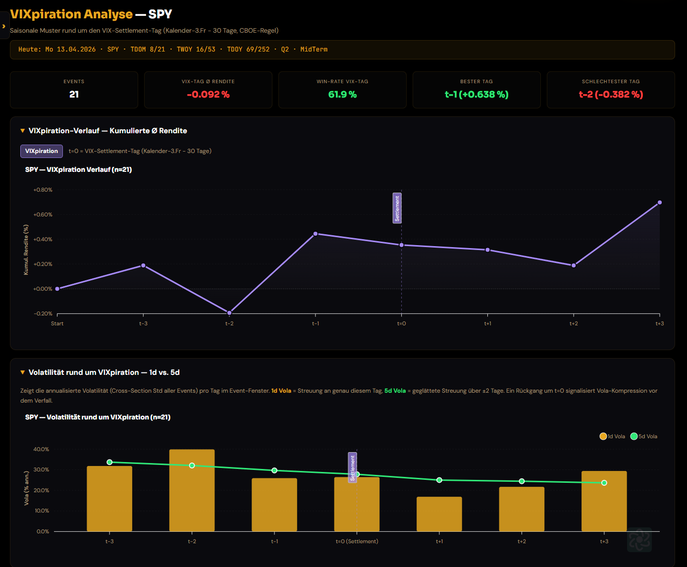

<!--
Keyword-Plan:
- Haupt-Keyword: VIXpiration April 2026
- Neben-Keywords: VIX-Verfall, VIX-Settlement, VIX-Optionen Verfall, Volatilitäts-Index
- LSI: CBOE, VIX Futures, Options Expiration, Verfallswoche Volatilität, Vola-Kompression
-->

## Was ist die VIXpiration?

Jeden Monat verfallen VIX-Optionen und -Futures an der CBOE — und zwar **nicht am gleichen Tag wie Aktienoptionen** (OPEX). Während der reguläre OPEX-Verfall am dritten Freitag stattfindet, wird das VIX-Settlement 30 Kalendertage vorher berechnet:

- **Basis:** Dritter Freitag des Monats (Kalender)
- **VIX-Settlement:** Basis minus 30 Kalendertage → typischerweise ein **Mittwoch**
- **Feiertags-Regel:** Fällt der Basis-Freitag oder der Settlement-Mittwoch auf einen NYSE-Feiertag, wird das Settlement um einen Handelstag vorgezogen

Für April 2026 bedeutet das:

| Datum | Event |
|-------|-------|
| 17.04.2026 (Fr) | OPEX — Dritter Freitag |
| **15.04.2026 (Mi)** | **VIXpiration — VIX-Settlement** |
| 14.04.2026 (Di) | Letzter VIX-Handelstag |

## Warum ist das relevant für Trader?

Rund um die VIXpiration passieren systematische Dinge an den Märkten. Institutionelle Händler und Market Maker müssen ihre VIX-Hedges rollen oder auflösen. Das erzeugt messbare Muster — nicht nur im VIX selbst, sondern auch im S&P 500.

Wir haben auf der neuen [VIXpiration-Seite](/vixpiration) alle VIX-Settlement-Termine der letzten 21 Jahre ausgewertet und die Renditen des SPY rund um den Verfallstag gemessen.

## Was zeigen die Daten?

Der Chart zeigt den durchschnittlichen kumulierten Renditeverlauf des SPY rund um die VIXpiration (t=0). Einige Beobachtungen:

### 1. Der Tag vor dem Settlement (t-1) ist der stärkste

Mit einer durchschnittlichen Rendite von **+0,64 %** ist der Dienstag vor dem VIX-Settlement historisch der beste Tag im Fenster. Die Win-Rate liegt bei knapp 62 %. Das ist kein Zufall — am Dienstag werden die letzten VIX-Positionen gerollt, und die Auflösung der Hedges erzeugt Kaufdruck im S&P 500.

### 2. Der Tag t-2 ist der schwächste

Zwei Tage vor dem Settlement — also der Montag davor — zeigt historisch die stärkste Schwäche mit **-0,38 %**. Hier beginnen die Positionsanpassungen, und die Unsicherheit über das Settlement drückt auf die Kurse.

### 3. Die Volatilität sinkt am Verfallstag

Der Vola-Chart darunter zeigt es deutlich: Die 1d-Volatilität (goldene Balken) fällt am Settlement-Tag (t=0) und den Folgetagen spürbar ab. Die 5d-Vola (grüne Linie) bestätigt den Trend geglättet. Das ist die klassische **Vola-Kompression** rund um den Verfall — Unsicherheit wird aufgelöst, Hedges abgebaut, der Markt beruhigt sich.

### 4. Nach dem Settlement steigen die Kurse tendenziell

Ab t+1 dreht der Verlauf nach oben. Die Kumulierte Rendite steigt von +0,30 % am Settlement auf +0,68 % drei Tage danach. Die Post-VIXpiration-Phase profitiert davon, dass das Gamma-Exposure der Market Maker zurückgeht und der Markt freier laufen kann.

## Was bedeutet das für diese Woche?

Der VIX-Verfall am **Mittwoch, 15. April 2026**, steht bevor. Wenn sich das historische Muster wiederholt:

- **Montag 14.04.** (t-1): Historisch positiv (+0,64 % Ø) — aber der stärkste Tag ist knapp
- **Dienstag 15.04.** (t=0, Settlement): Leicht positiv, Vola-Rückgang erwartet
- **Mittwoch–Freitag** (t+1 bis t+2): Historisch ruhigere Phase mit Aufwärtstendenz

Natürlich gibt es keine Garantie. Aktuelle Makro-Ereignisse können das Muster jederzeit überlagern. Aber die statistische Basis aus 21 Jahren ist solide genug, um ein Auge auf den VIX-Kalender zu haben.

## Analysiere es selbst

Auf der neuen **[VIXpiration-Seite](/vixpiration)** kannst du den Effekt für jeden Ticker und Zeitraum selbst prüfen — mit Heatmap, Signifikanztest, Backtest und Streak-Analyse. Die Seite zeigt auch den vollständigen VIX-Settlement-Kalender mit den nächsten 10 Terminen.

<!-- **LinkedIn:** VIXpiration am 15.04. — wie wirkt sich der VIX-Optionsverfall auf den S&P 500 aus? 21 Jahre Daten zeigen: t-1 ist der stärkste Tag (+0,64 %), die Volatilität sinkt am Verfallstag deutlich. Analyse auf SeasonAlpha: https://seasonalpha.ai/blog/vixpiration-april-2026/ #vix #opex #trading #saisonalitaet **Twitter/X:** VIXpiration Mi 15.04.2026 — was sagen 21 Jahre SPY-Daten? t-1: +0,64% Ø (Win-Rate 62%), Vola sinkt am Settlement deutlich 📉 Neue VIXpiration-Seite auf SeasonAlpha: seasonalpha.ai/vixpiration #VIX #OPEX #SPY -->
