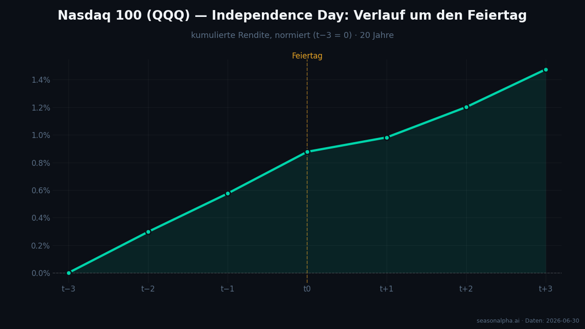
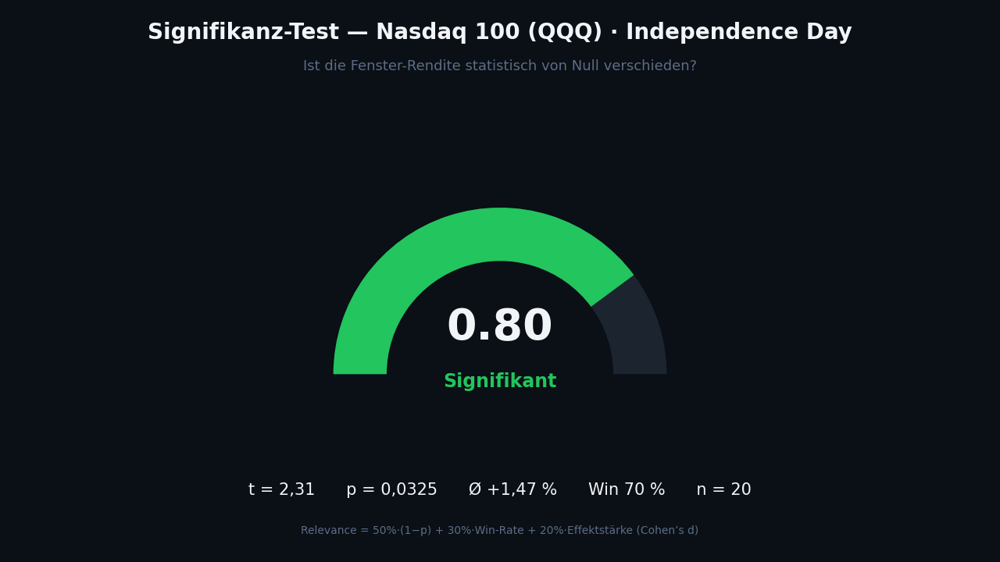

<!--
Keyword-Plan:
- Haupt-Keyword: Independence-Day-Effekt Nasdaq
- Neben-Keywords: Feiertags-Effekt Börse, Pre-Holiday-Effekt, 4. Juli Aktien, Nasdaq Saisonalität, QQQ Feiertag, Post-Holiday-Drift, Signifikanztest Saisonalität
- LSI: Fenster-Rendite, Win-Rate, p-Wert, Handelstage, normalisierte Renditen, t0, Trefferquote
-->

## Ein Feiertag mit Muster

Am **4. Juli** feiern die USA den Independence Day — die Börsen in New York bleiben geschlossen. Und ausgerechnet um diesen Feiertag herum zeigt einer der wichtigsten Indizes der Welt ein bemerkenswert stabiles saisonales Muster. Die zitierfähige Kernzahl vorab: **Rund um den 4. Juli legte der Nasdaq 100 — abgebildet über den ETF QQQ — historisch im Schnitt +1,47 % zu**, gemessen im Fenster von drei Handelstagen vor bis drei Handelstagen nach dem Feiertag. In **70 % der letzten 20 Jahre** war dieses Fenster positiv. Und das Wichtigste: Der Effekt ist **statistisch signifikant**.

Das ist kein Zufallsfund, sondern ein bekanntes Phänomen mit eigenem Namen: der **Feiertags-Effekt**, bestehend aus dem *Pre-Holiday-Effekt* (Stärke vor der Börsenschließung) und dem *Post-Holiday-Drift* (Kursverhalten danach).

## Wie sich der Nasdaq um den 4. Juli bewegt

Der folgende Verlauf zeigt die durchschnittliche, kumulierte Rendite des QQQ rund um den Independence Day über 20 Jahre. Die Zeitachse ist am Feiertag ausgerichtet: `t−3`, `t−2`, `t−1` sind die Handelstage **vor** der Schließung, `t0` markiert den **ersten Handelstag am oder nach dem Feiertag**, `t+1` bis `t+3` die Tage danach. Der Fensterbeginn ist auf 0 % normiert, damit sich verschiedene Jahre fair mitteln lassen.

Man sieht ein klares Bild: Schon **vor** dem Feiertag zieht der Index an — von 0 % bei `t−3` auf rund +0,88 % bis `t0`. Das ist der **Pre-Holiday-Effekt**: An den letzten dünnen Handelstagen vor einer Börsenschließung tendierten Aktien historisch überdurchschnittlich nach oben. Nach dem Feiertag geht es weiter: Bis `t+3` summiert sich die durchschnittliche Fenster-Rendite auf **+1,47 %** — der **Post-Holiday-Drift**.

Bemerkenswert ist die Gleichmäßigkeit. Der Verlauf klettert über fast das gesamte Fenster stetig, ohne größere Rücksetzer im Durchschnitt. Genau diese Stetigkeit ist es, die den Effekt statistisch belastbar macht.

## Ist das nur Zufall? Der Signifikanztest

Ein Durchschnitt allein sagt wenig — entscheidend ist, ob er sich statistisch von null unterscheidet oder ob wir nur Rauschen betrachten. Dafür rechnen wir einen **t-Test** der 20 Fenster-Renditen gegen null.

Die Zahlen sprechen eine klare Sprache:

- **t-Statistik = 2,31** — das Signal ist deutlich größer als die Streuung erwarten ließe.
- **p-Wert = 0,0325** — er liegt **unter der 5-%-Schwelle**. Übersetzt: Wäre der wahre Effekt null, läge die Wahrscheinlichkeit, ein so starkes Muster rein zufällig zu sehen, bei nur rund 3 %.
- **Win-Rate 70 %**, **Ø +1,47 %**, **n = 20**, Effektstärke (Cohen's d) = 0,52.

Aus diesen Bausteinen ergibt sich ein **Relevance-Score von 0,80** — grün, „signifikant". Der Score kombiniert drei Dimensionen: `Relevance = 50 % · (1 − p) + 30 % · Win-Rate + 20 % · Effektstärke`. Er fasst zusammen, wie belastbar *und* wie wirtschaftlich relevant ein Muster ist — nicht nur, ob es zufällig sein könnte.

## Warum es diesen Effekt gibt

Saisonale Feiertags-Effekte sind gut dokumentiert und haben plausible, wiederkehrende Treiber — auch wenn keiner davon ein Naturgesetz ist:

- **Dünne Handelsvolumina:** Vor langen Feiertagswochenenden ziehen sich viele Marktteilnehmer zurück. In dünnen Märkten genügen wenige Käufer, um Kurse nach oben zu schieben.
- **Positive Grundstimmung:** Rund um Feiertage überwiegt historisch eine optimistische Stimmung („holiday cheer") — Anleger halten seltener Short-Positionen über die Schließung.
- **Keine schlechten Nachrichten:** An geschlossenen Tagen und drumherum werden seltener negative Unternehmens- oder Konjunkturdaten verarbeitet.
- **Struktur-Effekte:** Zuflüsse aus Sparplänen und die Wiederanlage zum Monats-/Quartalsanfang fallen teils in dieses Fenster.

Diese Treiber erklären, warum das Muster über zwei Jahrzehnte erstaunlich stabil blieb — aber auch, warum es in einzelnen Jahren komplett ausfallen kann.

## Grenzen — und warum „signifikant" nicht „sicher" heißt

So sauber die Statistik aussieht: Ein signifikanter Effekt ist ein **Wahrscheinlichkeits-Kontext, kein Signal**. Drei Einschränkungen sind entscheidend:

1. **n = 20 ist eine kleine Stichprobe.** Zwanzig Feiertage sind statistisch nicht viel. Ein einzelnes Ausreißerjahr kann den Durchschnitt spürbar bewegen.
2. **p = 0,03 heißt nicht „klappt immer".** Die Win-Rate von 70 % bedeutet umgekehrt: In rund **drei von zehn Jahren war das Fenster negativ**. „Signifikant" beschreibt die Vergangenheit, nicht die nächste Runde.
3. **Muster können sich abschwächen.** Je bekannter ein saisonaler Effekt, desto eher wird er teilweise wegarbitriert. Historische Verläufe sind keine Garantie für die Zukunft.

## Was Anleger daraus lesen — und was nicht

Der Independence-Day-Effekt liefert keinen Fahrplan, aber wertvollen **Kontext**. Wer die ersten Julitage beobachtet, sollte wissen, dass Stärke rund um den Feiertag historisch die Regel und nicht die Ausnahme war — ein Grund weniger für hektische Schlüsse, wenn es ruhig aufwärtsgeht. Wer Saisonalität aktiv nutzt, kombiniert sie typischerweise mit weiteren Filtern statt sich allein darauf zu verlassen.

Den **Feiertags-Effekt für jeden Ticker und jede Börse** — NYSE, XETRA, LSE — kannst du interaktiv im [Feiertags-Tool](/feiertage) von SeasonAlpha erkunden, inklusive Ranking und Signifikanztest. Ergänzend zeigen der [saisonale Jahreszyklus](/jahreszyklus) und der [Monatszyklus](/monatszyklus), wie sich einzelne Werte über das Jahr bewegen.

## Methodik & Transparenz

Gerechnet wird ausschließlich in **Handelstagen**, nicht in Kalendertagen: Das Fenster zählt Börsentage vor und nach dem Feiertag, Wochenenden und weitere Schließungen werden übersprungen. `t0` ist der erste Handelstag am oder nach dem Feiertag. Jedes Event wird auf den **Fensterbeginn normiert** (Close bei `t−3` = 0 %), damit Jahre mit unterschiedlichem Kursniveau vergleichbar sind. Der Feiertagskalender folgt dem **Handelsplatz** (NYSE für QQQ). Datenbasis: täglich aktualisierte Kurse (Yahoo Finance). Die volle Methodik steht auf der [Feiertags-Seite](/feiertage) und unserer [Methodik-Übersicht](/ueber-uns).

## Fazit

Der **Independence-Day-Effekt** ist eines der klarsten Feiertags-Muster am US-Markt: Rund um den 4. Juli legte der Nasdaq 100 historisch im Schnitt **+1,47 %** zu, in **70 %** der Jahre positiv — und das Ergebnis ist **statistisch signifikant** (p = 0,03). Das ist kein Versprechen, aber ein belastbarer Kontext. Den Effekt für jeden Ticker findest du auf [seasonalpha.ai/feiertage](https://seasonalpha.ai/feiertage).

## Häufige Fragen

### Was ist der Pre-Holiday-Effekt?
Die historische Tendenz von Aktienmärkten, an den letzten Handelstagen vor einem Börsenfeiertag überdurchschnittliche Renditen zu zeigen. Beim Nasdaq rund um den 4. Juli lässt sich das im Anstieg von `t−3` bis `t0` ablesen.

### Wie stark ist der Effekt beim Nasdaq?
Im Fenster t−3 bis t+3 rund um den 4. Juli betrug die durchschnittliche Rendite des QQQ historisch +1,47 %, mit einer Trefferquote von 70 % über 20 Jahre.

### Heißt „statistisch signifikant", dass es sicher eintritt?
Nein. Ein p-Wert von 0,03 bedeutet, dass ein so starkes Muster unter reinem Zufall unwahrscheinlich wäre. Es beschreibt die Vergangenheit. In rund 30 % der Jahre war das Fenster trotzdem negativ — Garantien gibt es nicht.

### Gilt der Effekt für andere Feiertage und Börsen?
Feiertags-Effekte existieren an vielen Börsen, fallen aber je nach Feiertagskalender unterschiedlich aus. Das interaktive [Feiertags-Tool](/feiertage) wertet NYSE-, XETRA- und LSE-Feiertage pro Ticker aus.

<!--
#### Social Media Snippet
**LinkedIn:** 🎆 Der 4. Juli und die Börse: Rund um den Independence Day legte der Nasdaq 100 (QQQ) historisch im Schnitt +1,47 % zu — in 70 % der letzten 20 Jahre, und statistisch signifikant (p=0,03). Pre-Holiday-Effekt + Post-Holiday-Drift, sauber im Signifikanztest. Daten + interaktives Feiertags-Tool: seasonalpha.ai/feiertage
**Twitter/X:** Nasdaq rund um den 4. Juli 🎆📈 Ø +1,47 %, in 70 % der Jahre positiv — und statistisch signifikant (p=0,03). Der Feiertags-Effekt in Zahlen. #Nasdaq #Saisonalität #SeasonAlpha

#### Interne Verlinkung
- /feiertage (interaktives Feiertags-Tool + Signifikanztest)
- /jahreszyklus (saisonaler Jahresverlauf)
- /monatszyklus (Ø Rendite je Monat)

#### Content-Ideen (Folgeartikel)
- "Thanksgiving-Rally: Der stärkste Feiertags-Effekt des Jahres?"
- "Pre-Holiday-Effekt im Börsenvergleich: NYSE vs. XETRA vs. LSE"
-->
